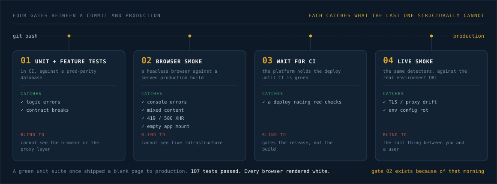

<p align="center">
  
</p>

<p align="center">
  
  
  
  
</p>

<h3 align="center">One command &nbsp;·&nbsp; ten playbooks &nbsp;·&nbsp; every rule written the day a real deploy broke</h3>

You can build a product with an AI agent in a weekend. You cannot absorb ten years of operational discipline in the same weekend. So the app ships, and the parts nobody taught you about are exactly the parts that are missing: nothing standing between a bad commit and your users, a token you pasted into a chat window six weeks ago, an audit log that doesn't exist, and eventually a security questionnaire from your first real customer that you have no honest way to answer.

MIDAS is that missing decade, encoded as a command. It scores what your app is actually missing, closes the gaps in priority order, and names the specific failure each rule prevents while it does it — so the discipline ends up in your head, not just in your repo.

This repo is the MIDAS framework: one Claude Code command, `/midas`, routing ten executable playbooks over a protocol library, a nine-domain control catalog, and a vendored copy of **AEGIS** as its review spine.

<p align="center">
  
</p>

## The deploy that passed every test

A build ran its suite: 107 tests, all green. It deployed. `curl` returned 200 and the HTML looked right. Every browser that loaded the page rendered white.

The platform terminated TLS at its edge and forwarded plain HTTP to the app. The app, seeing HTTP, generated `http://` asset URLs. Browsers refused to load those on an HTTPS page and blocked them silently. Nothing in the unit suite could see it, because a unit suite has no browser, no proxy, and no mixed-content policy. `curl` couldn't see it either — `curl` doesn't enforce that policy, and checking asset *paths* instead of full *URLs* hides the scheme entirely.

That is not an exotic bug. That is Tuesday for anyone shipping behind a PaaS without knowing what a reverse proxy does to their request headers. The fix is one line of config. The reason it reached production is that nothing in the pipeline was structurally capable of catching it.

MIDAS exists because "my tests pass" and "my app works" are different claims, and only one of them is the one your users experience. Every gate in the diagram above catches a class the one before it structurally cannot, and every protocol in the library below was written the morning a specific bug got through.

## Contents

- [Who this is for](#who-this-is-for)
- [Quick start](#quick-start)
- [Start with `assess` — always](#start-with-assess--always)
- [The ladder](#the-ladder)
- [The ten commands](#the-ten-commands)
- [The four gates](#the-four-gates)
- [The protocol library](#the-protocol-library)
- [The control catalog](#the-control-catalog)
- [Compliance without the theater](#compliance-without-the-theater)
- [AEGIS rides inside](#aegis-rides-inside)
- [When it breaks](#when-it-breaks)
- [Findings land in your planning system](#findings-land-in-your-planning-system)
- [Every stack, one set of principles](#every-stack-one-set-of-principles)
- [Railway, specifically](#railway-specifically)
- [The growth contract](#the-growth-contract)
- [How this compares](#how-this-compares)
- [What MIDAS is not](#what-midas-is-not)
- [Architecture](#architecture)
- [Ecosystem](#ecosystem)

## Who this is for

A solo builder or small team shipping real software to real companies. Strong on product. Never worked inside an engineering org that had a platform team, a security review, or a runbook. The gap is not intelligence — it is exposure. Nobody has ever walked you through why a 403 is a security bug, why an untested backup is not a backup, or why the difference between `env('X', $default)` and `env('X') ?: $default` can silently seed your database with an empty owner email.

The failure mode this framework was built against is specific and common: an app that works, in front of a buyer whose security team asks six questions, and none of them are about features.

MIDAS assumes you know your codebase and don't know the operational layer. Every action it takes gets explained in two sentences: what the control is, the real failure it prevents, and the compliance criterion it satisfies. You end up with a hardened app and the reasoning behind it, which is what makes the *next* app start hardened by habit.

## Quick start

Requires [Claude Code](https://claude.ai/code) — `~/.claude/` must exist.

```bash
# 1. install the router (exactly one menu entry)
cp src/midas.md ~/.claude/commands/midas.md

# 2. install the framework body (off-menu)
mkdir -p ~/.base-frameworks/midas
cp -r src/tasks src/frameworks src/agents src/checklists src/templates src/context src/aegis \
  ~/.base-frameworks/midas/
```

Then, in Claude Code, from your app's repo:

```
/midas
```

MIDAS detects whether it knows this app yet, and routes. An app it has never scored goes to `assess` — it will not provision, harden, or make a compliance claim about an app it hasn't measured.

<details>
<summary><strong>Uninstall</strong></summary>

```bash
rm ~/.claude/commands/midas.md
rm -rf ~/.base-frameworks/midas
```

A standalone AEGIS install (`~/.claude/commands/aegis/`) is a separate product and is unaffected by either installing or removing MIDAS. The AEGIS copy inside MIDAS is invoked in place and never installs itself.

</details>

<details>
<summary><strong>Why one menu entry</strong></summary>

Ten commands would be ten entries in your slash-command menu, competing with every other tool you have installed. MIDAS ships as a thin router at `~/.claude/commands/midas.md` and keeps its ten playbooks, six reference frameworks, five checklists, five templates, and the vendored AEGIS fork in `~/.base-frameworks/midas/`, loaded on demand by the route you take. You get one entry; the framework gets its full body.

Nothing is loaded upfront except the app registry. Each playbook declares its own framework, checklist, and template needs and pulls them when it reaches the step that requires them.

</details>

## Start with `assess` — always

`assess` is the only command that can lower your score, and the only one that produces the input every other command reads. It refuses to accept your description of your setup and reads the app instead, across eight areas:

| # | What it inventories | Why it matters |
|---|---|---|
| 1 | **Hosting & environments** | How many environments exist, and whether each has its own data store. A shared database makes your staging tier decorative. |
| 2 | **Pipeline** | What actually stands between a push and a deploy. Usually less than you think. |
| 3 | **Secrets handling** | Hardcoded credentials, committed `.env` files, tokens in logs or chat transcripts. |
| 4 | **Migrations** | Whether schema changes rehearse on disposable data before they reach the data you can't replace. |
| 5 | **Audit logging** | Whether a mutation records actor, action, resource, and timestamp — or whether you'd be guessing after an incident. |
| 6 | **Auth model** | Roles, token scoping, and whether deactivating a user actually kills their live session. |
| 7 | **Data classification** | What personal or health data you hold, and whether it's encrypted at rest. |
| 8 | **Subprocessors** | Every third party in the data path. This is the one solo builders skip, and it is the one that voids HIPAA outright. |

It then walks all nine control domains, scores each control pass / fail / not-applicable, and computes `posture_score = passing ÷ applicable × 100`. A not-applicable control without a stated reason counts as a fail. The rubric is printed in the report, because a score you can't reproduce is not a measurement.

Output is a posture report with a gap list ordered by risk × effort, where **every gap names the MIDAS command that closes it**. You do not get a list of problems. You get a queue.

If the control catalog file is missing from your install, `assess` stops rather than scoring from memory. A number invented without the canonical rubric behind it is worse than no number, because you'd act on it.

## The ladder

The registry tracks one row per app, and the stage only moves forward.

```
assessed ──▶ provisioned ──▶ piped ──▶ hardened ──▶ compliant
   │              │             │           │            │
 scored      isolated envs   gates on   controls    evidence
 honestly    per tier        every      applied +   indexed +
             + deny-by-      deploy     verified    readiness
             default         path                   report
```

Each stage has a fail-closed checklist behind it, and a stage advances only when that checklist is green. `assess` is the only command permitted to move a score *down* — because re-scoring honestly is the whole point of re-scoring.

## The ten commands

| Command | What it does |
|---|---|
| `/midas` | Reads the registry, works out where this app is, and recommends one next action |
| `/midas assess` | Scores ops, security, and compliance posture; produces the gap queue |
| `/midas provision` | Stands up the environment ladder — isolated databases per tier, per-env domains, health checks, deny-by-default networking |
| `/midas pipeline` | Wires the gated CI/CD path: prod-parity test job, browser smoke, platform deploy hold, post-deploy live smoke |
| `/midas secrets` | Interactive provisioning, env-scoped deploy tokens, spawn-environment safety, rotation policy, and a clean secret scan |
| `/midas deploy` | Promotion, rollback, and hotfix — each with its own discipline and its own trap |
| `/midas smoke` | Authors the app's browser smoke spec with the four failure detectors |
| `/midas harden` | Walks the control catalog domain by domain, applying and *verifying* each missing control |
| `/midas compliance` | Maps controls to SOC 2 / HIPAA / GDPR, builds the evidence index, writes the readiness report |
| `/midas incident` | Severity-first incident response, then reconstruction from the audit trail |
| `/midas export` | Files findings into the app's own PAUL project as prioritized remediation phases |

Every command ends the same way: a fail-closed checklist, a registry update, and a note into the knowledge graph. If a checklist file is missing, the gate **fails** — a gate you cannot run is a gate that did not pass.

## The four gates

A deploy is gated by machine-verified truth, not hope. Four layers, each catching what the previous one structurally cannot:

| Gate | Where it runs | Catches | Structurally blind to |
|---|---|---|---|
| **Unit + feature tests** | CI, against a prod-parity database | Logic errors, contract breaks | Anything in the browser or proxy layer |
| **Browser smoke** | CI, headless browser against a served production build | Render errors, CSRF breaks, console errors, mixed content | Live infrastructure drift |
| **Wait for CI** | The platform holds the deploy until GitHub checks are green | A deploy racing ahead of red checks | Gates the release, not the build |
| **Live smoke** | Against the real environment URL, post-deploy | Proxy-layer drift, TLS problems, env-specific config rot | Nothing left after this |

Gates 1 and 2 are not redundant, and the argument that they are is the argument that shipped the blank page. A prod-parity database in CI matters for the same reason: SQLite in CI against Postgres in production lets dialect bugs walk straight through the gate.

**The four smoke detectors.** The browser smoke logs in, walks every route, and fails on:

1. **Console errors** — a missing import throws only at render time, and never during a unit run
2. **Mixed-content blocks** — `http://` assets on an `https://` page, the failure `curl` cannot see
3. **Non-2xx same-origin XHR** — a 419 means your CSRF token broke on session rotation; a 500 means the page swallowed a server error
4. **Empty app mount** — a 200 response with an empty `#app` is a failed render, not an uptime win

Three design rules are non-negotiable, and each exists because breaking it produced a useless gate:

- **Serial, never parallel.** Parallel runners race on shared server and global flag state. A flaky gate gets deleted, and then you have no gate.
- **Restore global state.** Any test that flips a feature flag or a setting puts it back, or test order silently changes outcomes.
- **Scope to your own origin.** A third-party CDN hiccup must not fail your deploy. A gate that cries wolf trains you to ignore it.

You never weaken a detector to reach green. Every failure the smoke reports is a real finding your unit suite missed.

## The protocol library

Twelve rules, each recording the rule itself, the actual failure it prevents, and the compliance control it satisfies. None of these are hypothetical. Each one corresponds to a bug that reached a real environment or a control that was actually implemented.

| | Protocol | Prevents | Control |
|---|---|---|---|
| **A1** | Reverse-proxy TLS trust + force HTTPS in production | The mixed-content blank screen behind a TLS-terminating edge | Availability, Processing Integrity |
| **A2** | SPA mutations go through the framework router, never a raw `fetch()` with a static CSRF token | 419s after login, when the session token rotates and the page's snapshot goes stale | Security (CSRF) |
| **A3** | A headless-browser smoke gate on every pipeline, with four detectors | The whole "passes 107 tests, blank in the browser" class | Processing Integrity, Change Management |
| **A4** | Child processes get an explicit environment; every outbound provider call gets a timeout | Auth failures that only appear in spawned contexts, and untimed calls that hang a user-facing flow forever | Confidentiality |
| **A5** | Secrets provisioned interactively, injected by env, never echoed, committed, or pasted into a session | Credential leakage into history, logs, or an agent transcript | Confidentiality, Security |
| **A6** | Provider endpoints are config, not code — `client_id`, `client_secret`, `redirect`, `authorize_url`, `token_url` all env vars | A code change and a redeploy every time a vendor moves an endpoint | Change Management, Vendor Management |
| **A7** | Data-access scope widens only through user-consented re-authorization, never a server-side grant | Silent expansion of what your platform can read — the first thing a security reviewer probes | Confidentiality, Privacy, HIPAA minimum-necessary |
| **A8** | Foreign and non-existent resources return the **same** 404 | Tenant and resource enumeration via the 403-vs-404 split | Security, Confidentiality |
| **A9** | Features ship dark — 404 when disabled — and release through a code-defined flag registry | Accidental exposure of half-built surfaces | Change Management |
| **A10** | Migrations run automatically on every deploy, but reach dev and stage before prod | Schema failures landing on data you cannot replace | Availability, Processing Integrity |
| **A11** | `env('X') ?: $default`, never `env('X', $default)` | An empty-string env var counts as "set", so the second-argument default never fires and config silently resolves to `""` | Processing Integrity |
| **A12** | Know the platform's structural limits before designing the deploy topology | An architecture the platform silently will not honor | Availability |

Three of them deserve the full treatment, because the reasoning is the transferable part:

<details>
<summary><strong>A1 — why `curl` lies to you</strong></summary>

**The rule:** set `trustProxies('*')` (or your stack's equivalent) and force HTTPS in production whenever the app runs behind a TLS-terminating edge. Railway, Cloudflare, any PaaS.

**What breaks without it:** the edge terminates TLS and forwards plain HTTP. Your app sees HTTP and generates `http://` asset URLs. The browser, having loaded the page over HTTPS, blocks every one of them. The page returns 200 to every automated check you own and renders white to every human.

**The diagnosis trap, codified:** `curl` does not enforce mixed-content policy — it will happily report success. And checking asset *paths* rather than full *URLs* hides the scheme bug completely, so even a careful manual inspection passes.

- *Wrong confidence:* "curl returns 200 and the HTML has the right asset paths, so the deploy is fine."
- *Right check:* a headless browser loads the page over `https` and fails on any mixed-content block or empty app mount.

There is no way to catch this class without a real browser. That is the entire argument for gate 2.

</details>

<details>
<summary><strong>A8 — why a 403 is a security bug</strong></summary>

**The rule:** a resource that belongs to someone else and a resource that does not exist return the identical status: 404. A 403 is reserved for "you are authenticated and you lack this specific ability."

**What breaks without it:** if `GET /records/9` returns 403 and `GET /records/10` returns 404, an attacker has just learned that record 9 exists. Iterate, and they've mapped your tenancy. The status code itself is the leak.

**And the deeper version:** the control is not an `if` check after you fetch the record. It is the query scope. Route-model binding resolves lookups through the authenticated org's relation, so a foreign ID is *unresolvable* — it 404s because it genuinely was not found, not because something caught it afterward.

- *Fails the control:* tenant B's records don't appear in tenant A's list view, but `GET /records/{tenant-B-id}` returns 200 with data. Your control was a `WHERE` clause in one view.
- *Passes the control:* every lookup is scoped, the foreign ID 404s, and anti-enumeration comes free.

</details>

<details>
<summary><strong>A11 — the config default that never fires</strong></summary>

**The rule:** `env('X') ?: $default`, not `env('X', $default)`.

**What breaks without it:** an env var set to an empty string is *set*. The second-argument default is only used when the key is absent, so it never fires. Your CI copies `.env.example`, which sets `OWNER_EMAIL=`, and the seeder creates an owner with an empty email. Nothing errors. Nothing logs. The system is simply wrong from that point forward.

```php
// BROKEN under partial env — CI's .env.example sets OWNER_EMAIL=""
'owner' => env('OWNER_EMAIL', 'admin@app.test')   // "" is "set" → default never fires

// DEFENSIVE
'owner' => env('OWNER_EMAIL') ?: 'admin@app.test' // "" is falsy → default fires
```

This is the shape of most operational bugs: not a crash, a silent wrong value that propagates until something downstream makes no sense.

</details>

**The anti-patterns these replace:**

| Anti-pattern | Why it fails | Protocol |
|---|---|---|
| "Tests pass, ship it" | Unit suites structurally cannot see the proxy, CSRF-rotation, or render layers | A1, A2, A3 |
| Trusting ambient env in spawned jobs | Works interactively, 401s in production | A4 |
| Pasting a token into a session "just this once" | It is in the transcript permanently | A5 |
| Hardcoded provider URLs | A vendor swap becomes a code change and a release | A6 |
| 403 for foreign resources | Confirms existence to an attacker | A8 |
| Feature flags checked in the UI only | The API surface is still live | A9 |
| Migrating prod first "because it's urgent" | The schema failure lands on the data that matters | A10 |

## The control catalog

Nine domains. Every control is a **binary gate** — the app satisfies it with evidence, or it does not. "Mostly" is a fail, and that phrasing is deliberate: auditors think in evidence, not intentions.

| Domain | The controls, in short |
|---|---|
| **1. Access control** | Least-privilege roles · deny-by-default everywhere · ownership transfer flows · MFA on admin accounts · session invalidation that kills session *and* tokens together · tenant isolation enforced in the query, not the nav bar |
| **2. Authentication & secrets** | No secrets in code, logs, or agent sessions · env-only injection with interactive provisioning · documented rotation cadence · explicit spawn environments · hashed passwords · scoped, expirable API tokens |
| **3. Audit & logging** | A dedicated immutable audit channel separate from app logs · actor + action + resource + timestamp on every mutation · no secret values in logs · enough detail to reconstruct an incident · a stated retention policy |
| **4. Data protection** | TLS end to end including proxy trust · encrypted casts for tokens and PII · a real data classification · minimum-necessary collection · a deletion path that is code, not policy · backups whose **restore has been tested** |
| **5. Network & transport** | Deny-by-default egress where feasible · TLS enforced with zero mixed content · HSTS, `X-Content-Type-Options`, CSP where practical · rate limiting on auth and expensive endpoints |
| **6. Input & tenant safety** | Validation at boundaries · anti-enumeration status codes · IDOR prevention through scoped binding · CSRF through the router · whitelists over blacklists for user-supplied identifiers |
| **7. Change management** | CI test and browser smoke gates on every deploy path · branch protection on prod · deploy approval · migrations rehearsed downstream · reviewable diffs for everything |
| **8. Vendor management** | An inventory of every third party touching your data · each vendor's data-handling posture · **BAAs where PHI flows** · config-over-code so a vendor swap is a variable change |
| **9. Availability** | Health checks wired to the restart policy · platform structural limits known and honored · a rollback path that has been **exercised** · a stated DR posture |

Two of these have teeth that builders consistently underestimate.

**An untested backup is not a control, it is a hope.** The control is not "backups exist." The control is "a restore has been performed, on a date you can name." Schrödinger's disaster recovery fails at exactly the moment you need it to work.

**Audit logs must exist before the incident, not after.** This is why the harden playbook applies audit-channel controls *early* in its walk: every control applied afterward then generates its own evidence as a byproduct. Retrofitted logging cannot testify about the past, and "we'll add logging when we need it" means the first time you need it is the first time you can't.

<details>
<summary><strong>Why "we'll harden before launch" is the #1 failure mode</strong></summary>

Controls woven in are cheaper than controls bolted on, and the gap is not marginal. A retrofit means touching code paths you wrote months ago under different assumptions, discovering that tenant isolation was a view-level filter all along, and producing no historical evidence — because evidence about the past cannot be manufactured in the present.

The same logic drives the compliance stance: pick one regime up front and design to it, rather than chasing three of them backward after a buyer asks. Front-loaded control design means the eventual audit *confirms* rather than *discovers*.

</details>

## Compliance without the theater

**MIDAS makes you audit-ready. It does not make you certified.** A licensed auditor certifies. That distinction is stated in every readiness report MIDAS produces, verbatim, because overclaiming compliance is itself a compliance failure — and "SOC 2 compliant" on a website after a self-assessment is the exact claim that turns a routine review into a finding.

The stance: **pick one target regime per app, up front, and let the others fall out of the overlap.** For B2B SaaS that's almost always SOC 2.

| Regime | What satisfies it |
|---|---|
| **SOC 2 — Security** | The bulk of the catalog: access control, audit logging, change management, secrets discipline, network controls |
| **SOC 2 — Availability** | Health checks, restart policy, tested backups, monitoring |
| **SOC 2 — Processing Integrity** | CI and browser smoke gates, migration rehearsal, defensive config fallbacks |
| **SOC 2 — Confidentiality** | Encryption in transit and at rest, credential isolation, tenant isolation in code |
| **SOC 2 — Privacy** | Data minimization, consented scope changes, retention and deletion paths |
| **HIPAA** | The above, plus minimum-necessary data flow — and a BAA with every subprocessor touching PHI |
| **GDPR** | Implemented export and deletion code paths, lawful basis and minimization, the audit trail that makes 72-hour breach notification survivable, processor agreements |

### The BAA hard gate

If protected health information flows through your system, **every subprocessor touching it needs a Business Associate Agreement** — your host, every integrated provider, every vendor in the data path. This is not a footnote. It is the thing solo builders miss that voids HIPAA compliance entirely, regardless of how good the technical controls are.

- *Voided:* encrypted database, immutable audit log, MFA everywhere — and PHI flowing through one vendor with no BAA. Non-compliant, full stop.
- *Compliant posture:* the same controls, plus a subprocessor inventory where every PHI-touching vendor has a signed BAA, or PHI is architecturally excluded from their path.

`/midas compliance` activates this gate automatically the moment the data classification flags PHI, and treats it as release-blocking.

### The evidence index

For every passing control, the compliance playbook records one triple:

```
control → satisfied by (code path / config / log channel) → evidence location
```

This shape is not arbitrary. It is literally the artifact a SOC 2 auditor requests on day one. Auditors do not ask whether you are secure — they ask you to show them. An answer that points at a file, a config key, and a log channel closes the question in minutes. An answer that begins "well, generally…" opens a finding.

Evidence must point somewhere concrete. A policy without a code path behind it gets **flagged, not counted** — a deletion policy with no deletion implementation fails the "show me" test, and counting it would put a false claim into a document a buyer will rely on.

The final gate: if any high-risk criterion is unmapped, the readiness report does not ship as "ready." It routes back to `harden`.

## AEGIS rides inside

[AEGIS](https://github.com/ChristopherKahler/aegis) is a multi-agent codebase audit system — twelve senior engineering personas across fourteen audit domains, with adversarial review and a formal epistemic schema. MIDAS ships a **vendored fork** of it at `src/aegis/`, so MIDAS users get the deep-review spine with no second install.

The division of labor:

| | MIDAS | AEGIS |
|---|---|---|
| **Question** | Is this app delivered and operated safely? | Is this codebase trustworthy, survivable, and understandable? |
| **Surface** | Environments, pipelines, secrets, deploys, controls, evidence | Architecture, data integrity, correctness, testing, reliability, change risk |
| **Output** | A posture score, a gap queue, applied controls, an evidence index | Severity-ranked findings, cross-validated, adversarially reviewed |
| **Called by** | You, per app, as ongoing operational work | `/midas harden` and `/midas compliance`, for deep review |

MIDAS's `src/agents/` holds three thin adapters — SRE, security engineer, compliance officer — that add MIDAS framing on top of the vendored personas without duplicating them. The adapter's job is to ask a MIDAS-shaped question of an AEGIS-shaped agent: is this reliability finding catchable by an existing gate, or does it demand a new one? Does this topology recommendation survive the platform's actual constraints?

<details>
<summary><strong>Fork rules and the sync path</strong></summary>

The vendored copy is a faithful mirror, pinned to an upstream commit and never edited in place. A modified vendored copy becomes unsyncable within two upstream releases, so MIDAS-specific adaptation lives in the adapter layer instead.

Two things the fork never does: it never runs its own `install.sh` (that would install or overwrite the *standalone* AEGIS surfaces, which are a separate product), and it never assumes `/aegis:*` commands exist. Inside MIDAS, the agent and workflow files are read and run in place.

Syncing is deliberate: review the upstream log since the pin, diff the delta file by file, re-copy only if the delta is wanted, update the pin, commit with the new pin in the message. Full procedure in [`src/aegis/FORK-README.md`](src/aegis/FORK-README.md).

</details>

## When it breaks

`/midas incident` classifies severity **before** containment, because the classification changes your legal obligations and the clock may already be running.

| Tier | Definition | Communication |
|---|---|---|
| **SEV-DATA** | Personal or customer data exposed, or plausibly exposed | User communication is mandatory. The notification clock may be running — GDPR gives 72 hours to notify the authority. Assume exposure until reconstruction proves otherwise. |
| **SEV-AVAIL** | Service degraded or down, no data exposure | Communication at your judgment; status transparency recommended |
| **SEV-MINOR** | Degradation invisible to users | Internal record only |

Under-classifying a data incident to avoid the communication burden is the single most expensive mistake available during an incident, because the exposure compounds with the concealment.

Containment order: cut the exposure path (a dark feature flag pays for itself here), rotate anything exposed — exposed and compromised are operationally identical, because you cannot prove a leaked value wasn't copied — and **preserve evidence**. Do not clean up logs. Reconstruction needs them.

Then the part that tests everything else you built: reconstruct the timeline from the audit trail. If you cannot answer who did what, when, and to which resource, **that gap is itself a release-blocking finding** and routes straight back to `harden`. The audit log's entire purpose is proven or disproven here, and finding out during an incident is finding out too late.

Every external communication is drafted for you to approve and send. The agent never sends on its own.

## Findings land in your planning system

A posture report nobody reopens is a document, not a change. `/midas export` writes findings into the app's own [PAUL](https://github.com/ChristopherKahler/paul) project so remediation goes through the same planning ceremony as feature work:

- One `MIDAS-{NN}-{slug}/CONTEXT.md` phase folder per gap, numbered by priority, each carrying the finding, its evidence pointer, the failure class it exposes, the command that fixes it, and suggested acceptance criteria
- A marker-wrapped precedence notice injected into the project's `STATE.md`, which PAUL loads first in every workflow — so no future session can plan feature work without seeing the security queue

The export is idempotent. Re-running after a re-assess refreshes existing folders in place, and findings that no longer appear get flipped to `RESOLVED` rather than deleted, because they are audit history. Your own numbered phases are never touched or renumbered.

`harden`, `pipeline`, `secrets`, `deploy`, `smoke`, and `compliance` all read those folders back: when one of them closes a finding, it flips that folder's status to `RESOLVED` with the date and the evidence pointer, and updates the notice table. The loop closes without you tracking it.

## Every stack, one set of principles

The split is load-bearing. When someone says "but we're on Django," the answer is never "then that control doesn't apply."

**Universal — no variation by stack:** the environment ladder · deny-by-default · secrets discipline · audit logging · the gate philosophy · migration rehearsal · the compliance crosswalk · reverse-proxy TLS trust · anti-enumeration.

**Stack-specific — the adapter:** only the API used to express each principle.

An adapter answers seven questions for its stack: how the app is told it sits behind a TLS edge · the mutation mechanism that keeps CSRF tokens fresh across session rotation · the field-encryption mechanism · the scoped-lookup mechanism that 404s foreign IDs · the empty-string-safe env read · the health endpoint · how migration ordering is guaranteed.

| Principle | Laravel + Inertia | Express / Node | Django |
|---|---|---|---|
| Reverse-proxy TLS trust | `trustProxies('*')` + force HTTPS | `app.set('trust proxy', true)` | `SECURE_PROXY_SSL_HEADER` |
| CSRF through the router | Inertia `router.put/post/delete` | Per-request token fetch middleware | Django CSRF with rotating token |
| Encrypted at rest | `'token' => 'encrypted'` casts | Field-level encryption or KMS columns | `django-encrypted-model-fields` |
| Tenant-scoped lookups | Scoped route-model binding | Query middleware scoped to `req.org` | Custom manager: `Model.objects.for_org(...)` |
| Config fallbacks | `env('X') ?: $default` | `process.env.X \|\| default` | `os.environ.get('X') or default` |
| Health endpoint | `/up` | Explicit `/healthz` with a DB check | `/healthz` view with a DB ping |

Laravel + Inertia + Vue on Railway is the proven default — it is the stack the framework was dogfooded against end to end. The Express and Django columns are **interface sketches**, not certified adapters. A full adapter lands when a real app on that stack goes through MIDAS, because an untested adapter is theory and this framework does not ship theory.

## Railway, specifically

MIDAS holds opinions about Railway in the strong sense: it configures Railway this way unless you override with a reason.

| Opinion | The failure it prevents |
|---|---|
| Connect the repo **in each environment**, each with its own trigger branch | Railway environments are siblings, not inheritors. An environment without its own repo connection silently never deploys, and you stare at a green pipeline wondering why prod is stale. |
| Volumes are single-service, so web + worker run **combined** until artifacts move to object storage | Splitting them on a shared-volume assumption produces an architecture the platform will not honor |
| **Wait for CI** enabled per environment | Without it, Railway deploys on push regardless of what CI thinks |
| One project token per environment (`RAILWAY_TOKEN_DEV/_STAGE/_PROD`) | A single almighty token means any job can touch prod, and revocation is all-or-nothing |
| Native GitHub integration over CLI uploads | CLI uploads show **no repo source** in the dashboard, so deploys become untraceable to commits and your change-management evidence evaporates |
| Per-environment domains, per-environment `APP_URL` and OAuth redirects | A staging app generating production URLs breaks signed URLs, OAuth callbacks, and asset generation in browser-only ways |
| Health check on the app's health endpoint, not `/` | A marketing page returns 200 while the app layer is down |

The two ways teams get this wrong: **under-configured** — one environment, repo connected once, no CI hold, one token in a `.env` file. Ships fast, unauditable, and the first bad migration lands on production data. **MIDAS-configured** — three isolated environments each with repo, branch, domain and URL, CI holds on, env-scoped tokens provisioned interactively, migrations rehearsed downstream. Same platform, audit-defensible.

## The growth contract

This is the part that compounds.

Every MIDAS run that fixes a novel operational bug appends a protocol to the library — same three fields, rule / failure it prevents / control satisfied — plus one line in the relevant checklist and one entry in the knowledge graph. New protocols land in the framework first, then the checklist, then the graph.

The framework's value is precisely that nothing learned is ever re-learned. A1 through A12 are the first twelve. The library is designed to be number thirteen's home before number thirteen happens to you.

## How this compares

**A checklist blog post** tells you what to do and knows nothing about your app. It cannot see that your staging database is the same database as production, cannot rank what to fix first, and cannot verify that you did it. MIDAS reads your repo, scores it against a rubric it prints, and exercises each control to confirm it actually bites.

**A compliance platform** (Vanta, Drata, and the category) monitors and collects evidence for controls that already exist. That is genuinely useful and it is a different job. Those tools tell you a control is missing; they don't sit inside your editor and implement scoped route-model binding in your codebase, then verify that a foreign ID 404s. MIDAS is the layer underneath — the one that builds the thing the monitoring platform is supposed to monitor.

**Asking your agent to "make it secure"** produces plausible, unranked, unverified changes with no evidence trail and no memory. Ask twice and you get two different answers. MIDAS is the same agent constrained by a canonical rubric, fail-closed gates, and a protocol library that grows — and when a routed file is missing, it stops and says so rather than improvising the workflow from memory. Silent improvisation is the failure class this framework exists to kill.

**Hiring a DevOps contractor** works, costs real money, and leaves when the engagement ends — usually taking the reasoning with them. MIDAS teaches the *why* alongside every change, which is the difference between an app that got hardened and a builder who now hardens by default.

The distinction that matters across all four: MIDAS produces **evidence as a byproduct of doing the work**, not as a retrofit before an audit. Historical evidence cannot be manufactured after the fact, and that is precisely what gets asked for.

## What MIDAS is not

Honest scoping is a feature here, not a disclaimer.

- **Not a feature-building framework.** That's PAUL's job. MIDAS handles delivery and hardening.
- **Not a certification.** MIDAS produces audit-*readiness*. A licensed auditor certifies, and counsel advises on obligations. The readiness report says so in its own text.
- **Not legal advice.** The compliance crosswalk is engineering-readiness guidance.
- **Not a linter or a code-quality tool.** That's your app's CI, and for deep code audit, standalone AEGIS.
- **Not autonomous.** Secret values are entered by you, interactively, and never enter an agent session. Dashboard actions are yours. External communications are drafted for your approval. The agent verifies *effects*, never credentials.

## Architecture

```
src/
  midas.md          the router — installs to ~/.claude/commands/midas.md
  tasks/            the 10 executable playbooks
  frameworks/       reference knowledge, loaded on demand
                      protocols · security-controls · compliance-maps
                      railway · stack-adapters · testing-gates
  checklists/       the fail-closed gates tasks block on
                      provision · pipeline · pre-deploy · security · soc2-readiness
  templates/        drop-in starting points
                      ci-yml · smoke-spec · dockerfile · railway-json · trustproxy-snippet
  agents/           MIDAS framing over the vendored AEGIS personas
  context/          per-app state — the registry, posture reports, evidence indexes
  aegis/            the vendored AEGIS fork (see its FORK-README.md)
scripts/
  readme-assets.py  regenerates docs/splash.svg and docs/gates.svg
```

**This repo is the source of truth.** Installed surfaces are copies. Edit here, then reinstall — never edit `~/.claude/commands/midas.md` or `~/.base-frameworks/midas/` directly, because the next reinstall silently discards the change.

Nothing loads upfront except the app registry. Each playbook declares its own framework, checklist, and template needs and pulls them at the step that requires them, which keeps a `/midas assess` run from dragging the entire control catalog and the vendored AEGIS fork into context before it needs a single line of either.

## Ecosystem

MIDAS is part of a broader Claude Code framework ecosystem.

| System | What it does | Link |
|---|---|---|
| **MIDAS** | Delivery and hardening — local dev to audit-defensible production | You are here |
| **AEGIS** | Multi-agent codebase auditing — diagnosis and controlled evolution | [GitHub](https://github.com/ChristopherKahler/aegis) |
| **BASE** | The knowledge graph — workspace memory, decisions, rules, code structure | [GitHub](https://github.com/ChristopherKahler/base) |
| **PAUL** | Project orchestration — Plan, Apply, Unify Loop | [GitHub](https://github.com/ChristopherKahler/paul) |
| **SEED** | Typed project incubator — ideation through graduation | [GitHub](https://github.com/ChristopherKahler/seed) |
| **Skillsmith** | Skill builder — standardized syntax specs and guided workflows | [GitHub](https://github.com/ChristopherKahler/skillsmith) |
| **CC Strategic AI** | Community, courses, live support | [Skool](https://chrisai.cv/skool) |

---

Built by Chris Kahler
[Chris AI Systems](https://chrisai.cv) / [Community](https://chrisai.cv/skool) / [YouTube](https://www.youtube.com/@chris-ai-systems)
